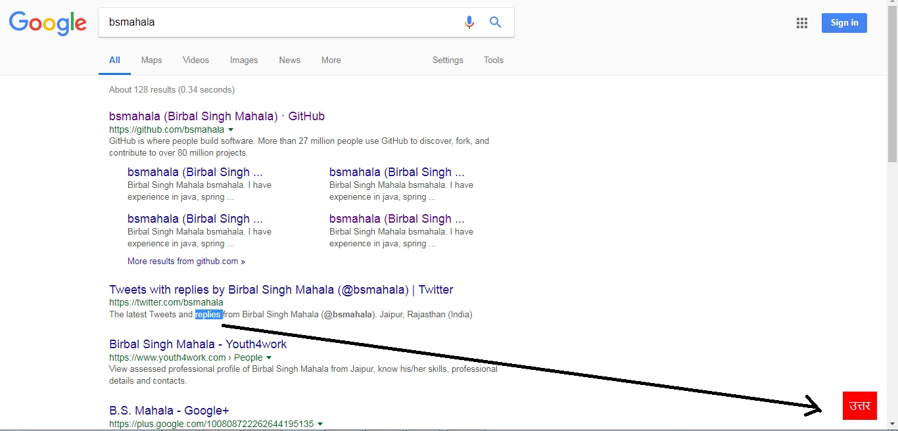
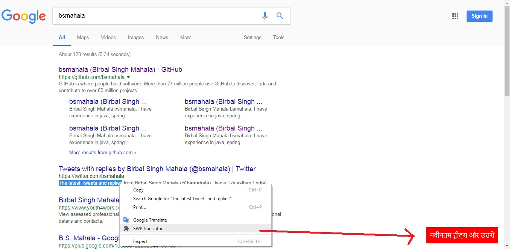

# react-redux-route-sass-login
This project is prepared to translate a sentence in onther language on webpage using shortcut (Alt + m) or ConextMenu after select a sentence.

#Project Use Images

## Use in chrome 

First download source code into computer
Install extension from localfolder

- [How to install extension from folder](https://www.google.co.in/search?q=how+to+install+a+chrome+extension+using+folder)

After refresh you webpage and Select a sentence what you want translate
then press Alt + m  or right click on selected text and click "SWP Traslator"

